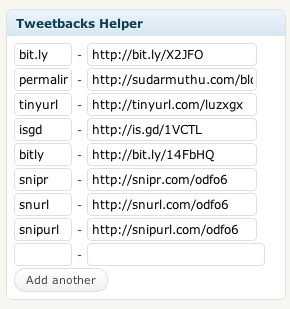

# Tweetbacks Helper #
**Contributors:** sudar 
**Tags:** tweetbacks, Twitter, Tweet, comments
**Requires at least:** 2.8
**Donate Link:** http://sudarmuthu.com/if-you-wanna-thank-me
**Tested up to:** 3.5
**Stable tag:** 0.9
	
Helper Plugin for Tweetbacks Plugin to help it detect more tweets

## Description ##

Tweetbacks Helper is a helper Plugin for Tweetbacks Plugin to help it detect more tweets.

### Features

This Plugin can disable Pseudo cron scheduler by Tweetbacks and replace it with its own scheduler, that can be invoked by pinging a url.

This Plugin also lists the short urls detected by Tweetbacks and allows you to add your own short urls if you are using your own url shortening service.

**More info**

*   [Plugin home page][1]
*   [Why this Plugin is needed][2]
*   Other [WordPress Plugins][3] by the same author

 [1]: http://sudarmuthu.com/wordpress/tweetbacks-helper
 [2]: http://sudarmuthu.com/blog/2009/07/31/helper-plugin-for-tweetbacks.html
 [3]: http://sudarmuthu.com/wordpress

### Translation

*   Belorussian (Thanks [FatCow][1])
*   German (Thanks Volunteer team of [Design Contest][3])
*   Lithuanian (Thanks Nata of [Web Hub][4])
*   Bulgarian (Thanks Dimitar Kolevski of [Web Geek][5])
*   Spanish (Thanks Mike Arias of [InMotion Hosting][6])
*   Romanian (Thanks Alexander Ovsov of [Web Hosting Geeks][7])
*   Hindi (Thanks Love Chandel)
*   Irish (Thanks Vikas Arora)
*   Slovak (Thanks Branco Radenovich)

The pot file is available with the Plugin. If you are willing to do translation for the Plugin, use the pot file to create the .po files for your language and let me know. I will add it to the Plugin after giving credit to you.

### Support

Support for the Plugin is available from the [Plugin's home page][2]. If you have any questions or suggestions, do leave a comment there.

 [1]: http://www.fatcow.com
 [2]: http://sudarmuthu.com/wordpress/tweetbacks-helper
 [3]: http://www.designcontest.com/
 [4]: http://www.webhostinghub.com/
 [5]: http://webhostinggeeks.com/
 [6]: http://www.inmotionhosting.com/
 [7]: http://webhostinggeeks.com/
	
## Installation ##

Extract the zip file and just drop the contents in the wp-content/plugins/ directory of your WordPress installation and then activate the Plugin from Plugins page. This Plugin needs the [Tweetbacks Plugin by Yoast][1] to work.

 [1]: http://wordpress.org/extend/plugins/tweetbacks/

## Screenshots ##

Settings page

Write post page

##Readme Generator## 

This Readme file was generated using <a href = 'http://sudarmuthu.com/wordpress/wp-readme'>wp-readme</a>, which generates readme files for WordPress Plugins.
